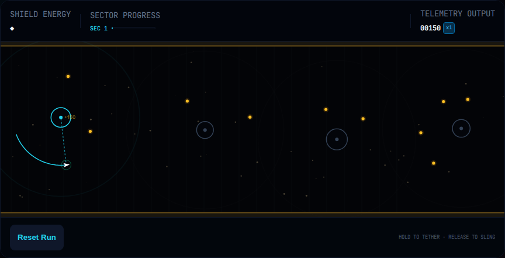

# GravityPivot

A small browser game built around one decision: **hold to tether, orbit an anchor, then release to sling through the cave.** Read the route, choose your release, and skim the walls to build a combo.



The GitHub Pages build is prepared at `https://gthgomez.github.io/GravityPivot/`; the live URL becomes active after the repository Pages setting is enabled and the reviewed publish workflow is run. No live deployment is claimed yet.

## Controls

- Hold Space while the playfield is focused, or press and hold on the playfield, to tether.
- Release to sling forward.
- Press `R` while the playfield is focused to reset the run.
- In Daily mode, the nearest anchor is selected automatically; mouse position does not change the challenge.

## What is implemented

- Standard runs with saved upgrades, skins, cores, and top-five scores.
- A UTC-dated, rules-versioned Daily challenge with standardized upgrades and physics.
- Seeded procedural geometry with seam, bounds, and extended seed checks.
- A fixed-step TypeScript simulation and Canvas 2D renderer.
- Saved sound and motion preferences, including system reduced-motion support.
- Validated local saves with non-destructive migration from legacy v6 keys.

Daily runs are locally comparable. The game has no server-side leaderboard or anti-cheat system.

## Architecture

The custom engine owns motion, tethering, collisions, scoring, and world progression. `WorldGenerator` owns seeded cave geometry. `CanvasRenderer` draws the world through the same viewport transform used by pointer input. The UI, Web Audio effects, pooled particles, and validated save state remain separate modules. The engine does not read or write browser storage.

## Development

Requires Node.js 24 LTS.

```bash
npm ci
npm run dev
```

## Verification

```bash
npm run verify
npm run test:browser
npm run test:procgen:extended
```

`npm run verify` checks formatting, lint, types, unit tests with targeted engine/generator/save coverage floors, and the production build. The Playwright suite exercises the production preview in desktop Chromium, touch-enabled Chromium emulation, and WebKit. These browser runs do not qualify physical iOS or Android devices. See [the performance profile](docs/PERFORMANCE_PROFILE.md) for current measurements and their hardware limits. Install browsers locally with `npx playwright install chromium webkit` (Linux CI also installs their system dependencies).

## License

The repository is public for source visibility and is proprietary. The [LICENSE](LICENSE) does not grant permission to reuse, modify, or redistribute the code.
